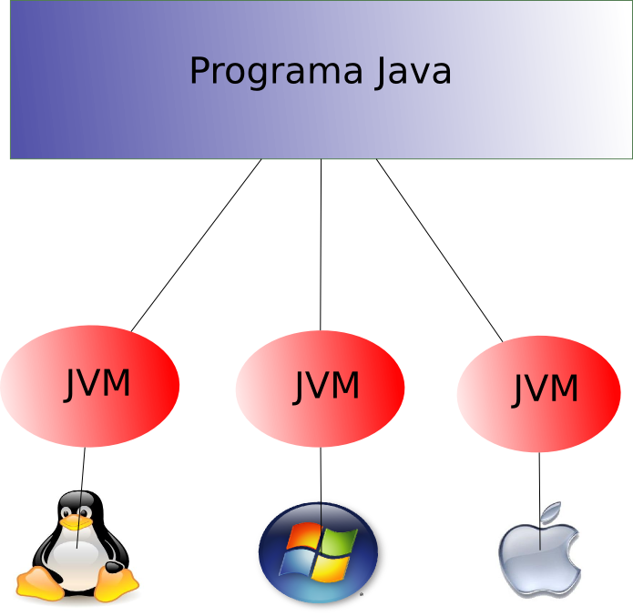

## Funcionamento básico da JVM

Nesse capítulo falará um pouco do funcionamento básico da JVM além das variáveis. Falará um pouco do coração da linguagem Java, a sua JVM. A JVM é responsável pela independência entre as plataformas e roda basicamente dois tipos de processos: 

* O escrito em java que são gerados **bytecodes** 
* Os nativos que são realizados em linguagens como o C\C++ que são *linkadas* dinamicamente para uma plataforma específica.

Os métodos nativos são muito interessantes para obter informações do SO sendo utilizado além de usar recursos da máquina. E é em função disso que apesar de a linguagem ser **RunAnyWhere** a JVM não é, ou seja, para cada plataforma existe uma máquina virtual específica. Isso acontece, por exemplo, para usar recursos específicos de uma máquina, por exemplo, existem chamadas para cada diretório e arquivos.

O único e principal motivo da JVM é rodar o aplicativo. Quando se inicia uma execução a JVM nasce e quando a aplicação termina ela morre. É criado uma JVM para cada aplicação, ou seja, se executar três vezes o mesmo código em uma mesma máquina serão iniciadas 3 JVMs. Para rodar uma aplicação basta que sua classe possua um método público e estático com o nome main e tenha como parâmetro um vetor de `String`.

Ao iniciar uma JVM existem alguns processos que rodam em paralelos e em backgrouns e executam diversas operações e processos para manter a JVM sempre disponível: 