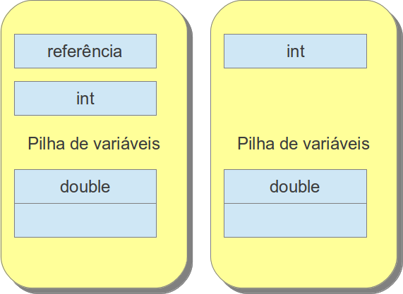

##### Stack variables

Cada **frame** contiene un vector para almacenar variables locales y parámetros y su tamaño es definido en tiempo de ejecución. En ese vector las variables `double` y `long` ocupan dos elementos del vector y son almacenados consecuentemente. Variables de tipo `int` y `returnAdress` ocupan un elemento de ese vector (`byte`, `short` y `char` son convertidos en `int`). Si el método es de instancia, no estático, el primer elemento de ese vector será ocupado por la instancia que está ejecutando ese método y enseguida los parámetros, en el orden que fueron pasados. Si el método es de clase, el método estático, no habrá referencia de la instancia que llama al método, así el primer elemento serán los parámetros.

