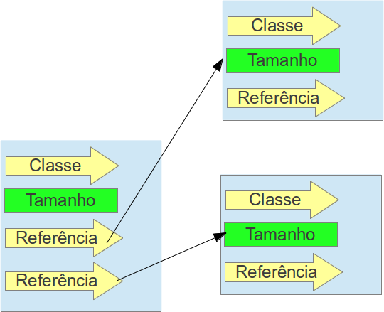

#### Heap Space

Tan pronto se crea una instancia, la información de su objeto queda almacenada aquí, ese espacio de memoria también es compartido entre los `Threads`. El **heap** tiene un mecanismo de reclamar memoria en tiempo de ejecución además de mover objetos evitando la fragmentación del espacio.

Representación de una variable de tipo de referencia dentro del **Heap** es diferente de los tipos primitivos, este tiene su mecanismo muy semejante a los punteros de `C/C++` ya que este no tiene la información, solo apunta para el lugar donde lo tiene. El objeto de referencia es constituido de dos punteros menores:

* Uno apuntará al pool de objetos, lugar donde está la información.
* El segundo apuntará para su constant pool (que tiene la información de la clase como los atributos, métodos, encapsulamientos, etc.) que queda localizado en el **method Area**.

La representación de los vectores se comporta de forma semejante a las variables de referencia, pero estos tienen dos campos más: 

1. **tamaño**, que define el tamaño del vector
2. **lista de referencia** que apunta a los objetos que están dentro de ese vector. 

